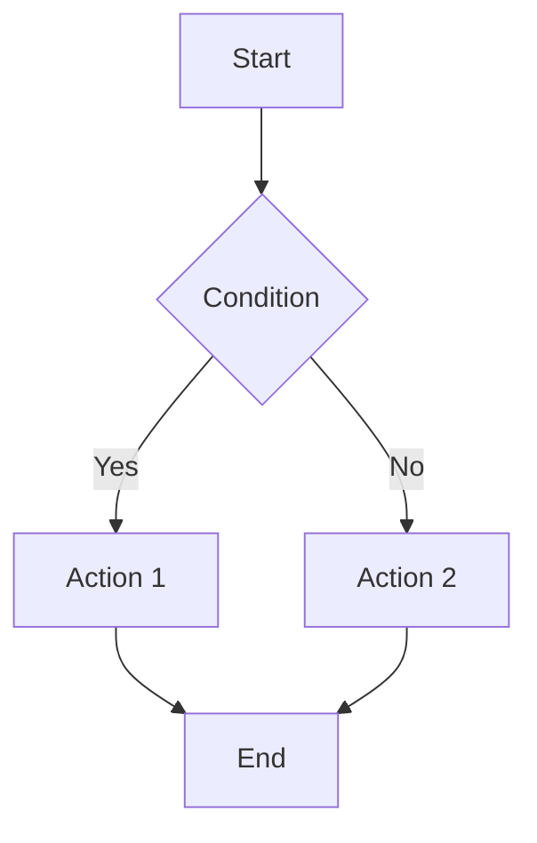

# Feature Documentation

## Overview

Tạo tài liệu MD tổng hợp đầy đủ logic, business rules, và cấu trúc code cho mỗi feature đã implement. File này cho phép developer mới chỉ cần đọc 1 file là hiểu toàn bộ feature.

**Announce at start:** "Tôi đang sử dụng skill feature-documentation để tạo tài liệu tổng hợp cho feature này."

**Save documentation to:** `docs/features/<feature-name>.md`

## Khi nào sử dụng

- Sau khi implement xong một feature mới
- Sau khi thay đổi logic quan trọng của feature có sẵn
- Khi cần tổng hợp lại một module phức tạp
- Trước khi bàn giao feature cho team khác

## Cấu trúc tài liệu bắt buộc

````markdown
# [Feature Name]

> **Cập nhật lần cuối:** YYYY-MM-DD
> **Người thực hiện:** [Name/Agent]
> **Trạng thái:** [Draft | Review | Approved | Production]

## 1. Tổng quan

### Mục đích
[1-2 câu mô tả feature này giải quyết vấn đề gì]

### Phạm vi
- [Những gì feature này làm]
- [Những gì feature này KHÔNG làm]

### Liên quan đến
- [Các feature/module khác có liên quan]

---

## 2. Business Rules

### Quy tắc nghiệp vụ chính

| STT | Quy tắc | Mô tả | Ví dụ |
|-----|---------|-------|-------|
| BR-01 | [Tên quy tắc] | [Chi tiết] | [Ví dụ cụ thể] |
| BR-02 | ... | ... | ... |

### Công thức tính toán (nếu có)

```
[Công thức 1]: Mô tả
Ví dụ: A = B × C / D
```

### Ràng buộc dữ liệu

| Field | Kiểu | Bắt buộc | Ràng buộc | Ghi chú |
|-------|------|----------|-----------|---------|
| ... | ... | ... | ... | ... |

---

## 3. Luồng xử lý (Flow)

### Flow chính

```
[Bước 1] User/System action
    ↓
[Bước 2] Validation
    ↓
[Bước 3] Business logic
    ↓
[Bước 4] Persist data
    ↓
[Bước 5] Response
```

### Flow diagram (nếu phức tạp)



### Các trường hợp đặc biệt

| Case | Điều kiện | Xử lý |
|------|-----------|-------|
| ... | ... | ... |

---

## 4. Cấu trúc Code

### Files liên quan

| File | Vai trò | Ghi chú |
|------|---------|---------|
| `path/to/Controller.cs` | API endpoints | [Mô tả ngắn] |
| `path/to/Service.cs` | Business logic | [Mô tả ngắn] |
| `path/to/Entity.cs` | Data model | [Mô tả ngắn] |
| ... | ... | ... |

### Database Schema

```sql
-- Table: [table_name]
CREATE TABLE [table_name] (
    id INT PRIMARY KEY,
    -- ... columns với comments
);

-- Indexes
CREATE INDEX IX_... ON ...;

-- Relationships
-- [table_name].field_id → [other_table].id
```

### API Endpoints

| Method | Endpoint | Mô tả | Request | Response |
|--------|----------|-------|---------|----------|
| POST | `/Feature/Create` | Tạo mới | `MReq_Feature` | `MRes_Feature` |
| PUT | `/Feature/Update` | Cập nhật | `MReq_Feature` | `MRes_Feature` |
| GET | `/Feature/GetById` | Lấy theo ID | `?id=int` | `MRes_Feature` |
| ... | ... | ... | ... | ... |

---

## 5. Logic chi tiết

### [Method/Function 1]

**Mục đích:** [Mô tả]

**Input:**
- `param1` (type): [Mô tả]
- `param2` (type): [Mô tả]

**Output:** [Mô tả]

**Logic:**
1. [Bước 1]
2. [Bước 2]
3. [Bước 3]

**Code snippet:**
```csharp
// Pseudo-code hoặc code thực
public async Task<Result> MethodName(Input input)
{
    // Step 1: Validate
    // Step 2: Process
    // Step 3: Return
}
```

### [Method/Function 2]
...

---

## 6. Validation & Error Handling

### Validation Rules

| Field | Rule | Error Message |
|-------|------|---------------|
| `field1` | Required | "Field1 là bắt buộc" |
| `field2` | MaxLength(100) | "Field2 không quá 100 ký tự" |
| ... | ... | ... |

### Error Codes

| Code | HTTP Status | Message | Khi nào xảy ra |
|------|-------------|---------|----------------|
| ... | ... | ... | ... |

---

## 7. Test Cases

### Unit Tests

| Test Case | Input | Expected Output | Status |
|-----------|-------|-----------------|--------|
| TC-01: [Tên] | [Input] | [Output] | ✅/❌ |
| ... | ... | ... | ... |

### Integration Tests

| Scenario | Steps | Expected | Status |
|----------|-------|----------|--------|
| ... | ... | ... | ... |

---

## 8. Cấu hình & Dependencies

### System Parameters

| Parameter | Giá trị | Mô tả |
|-----------|---------|-------|
| ... | ... | ... |

### Dependencies

- [Service/Module 1]: [Mục đích sử dụng]
- [Service/Module 2]: [Mục đích sử dụng]

---

## 9. Changelog

| Ngày | Người | Thay đổi |
|------|-------|----------|
| YYYY-MM-DD | [Name] | Initial implementation |
| ... | ... | ... |

---

## 10. Notes & TODOs

### Lưu ý quan trọng
- [Lưu ý 1]
- [Lưu ý 2]

### TODOs
- [ ] [Task 1]
- [ ] [Task 2]

### Known Issues
- [Issue 1]: [Mô tả và workaround nếu có]
````

## Checklist trước khi hoàn thành

- [ ] Tất cả business rules đã được document
- [ ] Tất cả công thức tính toán có ví dụ cụ thể
- [ ] Flow diagram đầy đủ và chính xác
- [ ] Tất cả files liên quan được liệt kê
- [ ] API endpoints có request/response rõ ràng
- [ ] Logic chi tiết cho các method quan trọng
- [ ] Validation rules đầy đủ
- [ ] Test cases được liệt kê
- [ ] Changelog được cập nhật

## Quy tắc viết

1. **Ngôn ngữ**: Tiếng Việt cho mô tả, tiếng Anh cho code/technical terms
2. **Cụ thể**: Luôn có ví dụ cụ thể cho mỗi rule/formula
3. **Cập nhật**: Ghi ngày cập nhật và người thực hiện
4. **Đơn giản**: Viết để người mới cũng hiểu được
5. **Đầy đủ**: Không bỏ sót business rule nào

## Ví dụ tên file

- `docs/features/attendance-management.md` - Quản lý chấm công
- `docs/features/production-tracking.md` - Theo dõi sản lượng mủ
- `docs/features/payroll-calculation.md` - Tính lương
- `docs/features/drc-rate-management.md` - Quản lý tỷ lệ DRC
