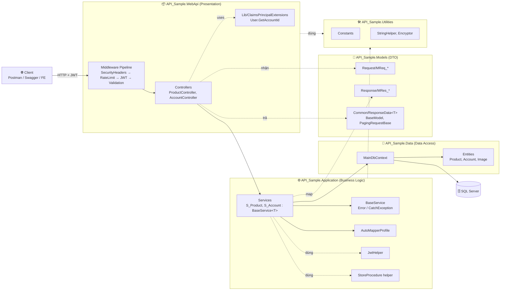
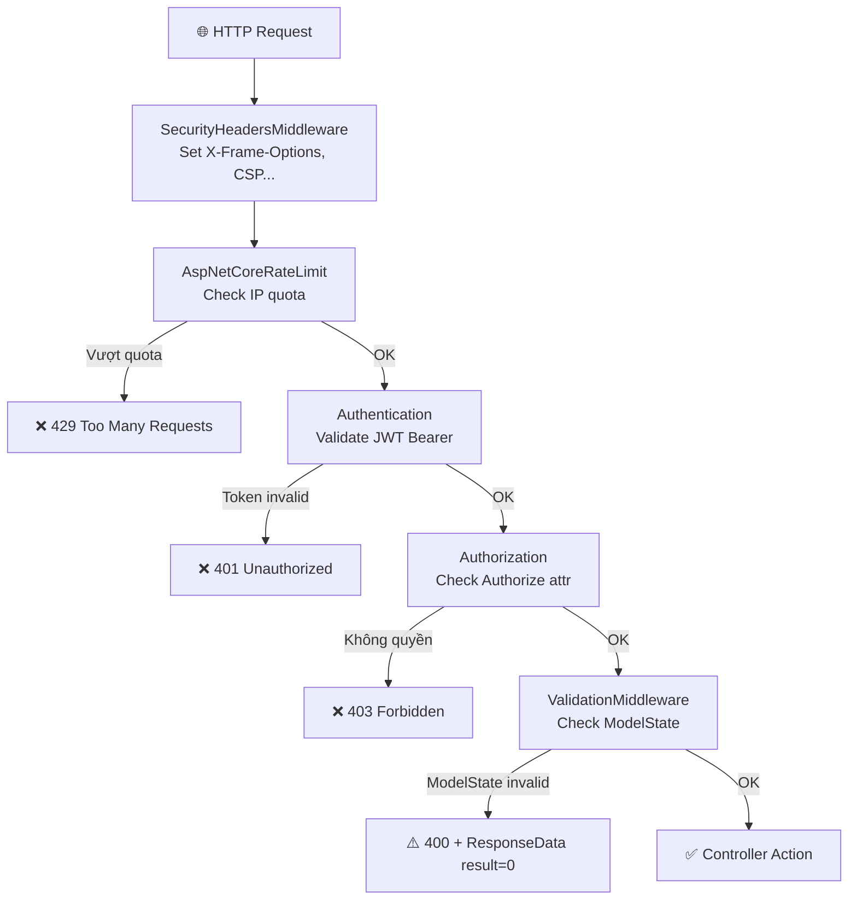
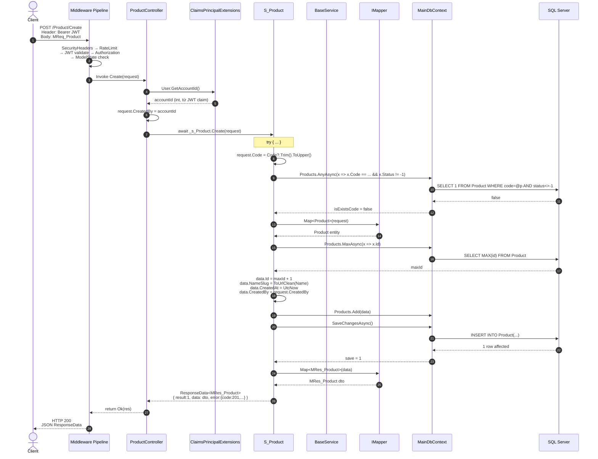
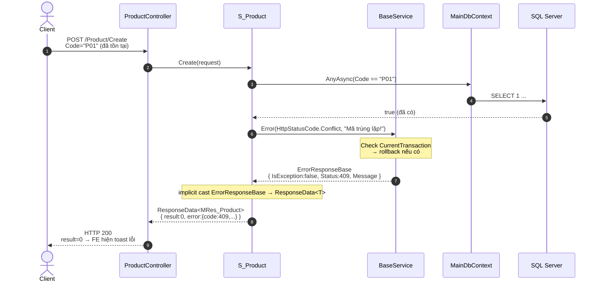
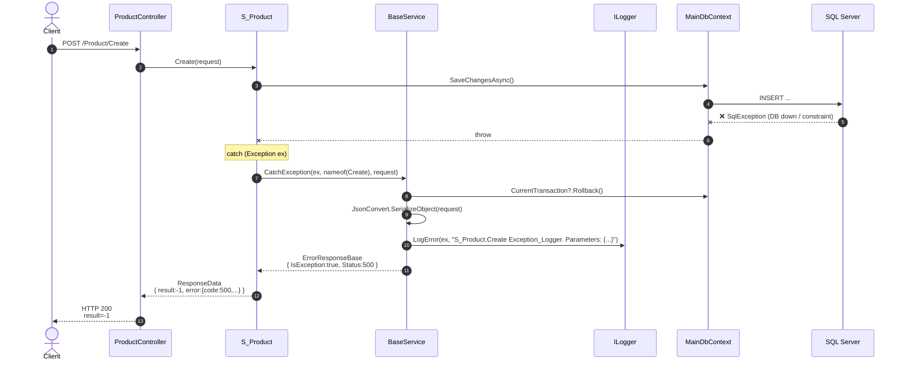
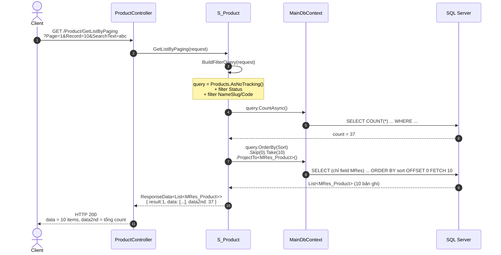
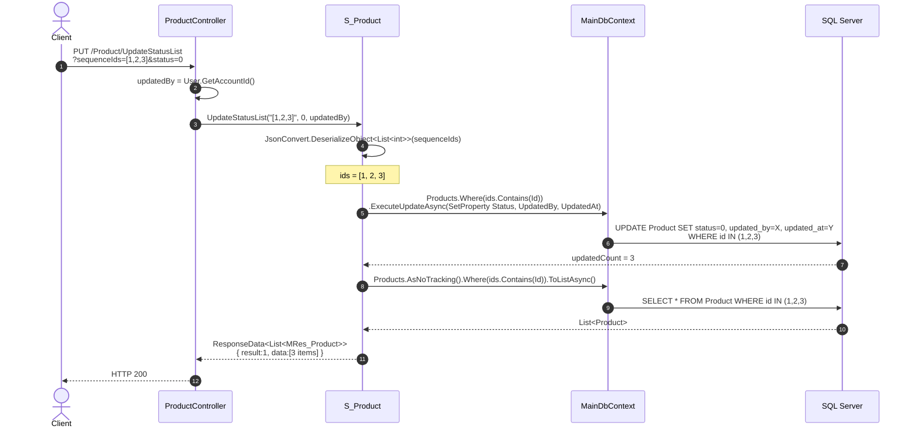
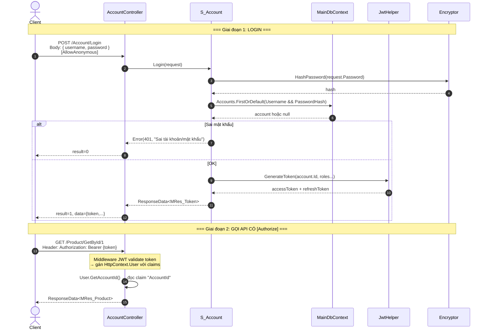

# API_Sample — Sơ đồ luồng code & Hướng dẫn test API

> Tài liệu này giúp bạn **hình dung** cách một request đi xuyên qua hệ thống và **test thực tế** để thấy dữ liệu di chuyển.

---

## 1. Kiến trúc tổng quan (Component diagram)



---

## 2. Middleware pipeline (Request đi từ client vào)



---

## 3. Luồng POST /Product/Create (Sequence — trường hợp thành công)



---

## 4. Luồng lỗi nghiệp vụ — Mã trùng (Error branch)



---

## 5. Luồng exception hệ thống (Catch branch)



---

## 6. Luồng GET /Product/GetListByPaging (query + paging)



> **Chú ý**: `data2nd = 37` → FE dùng tính tổng số trang = `Math.ceil(37/10) = 4`.

---

## 7. Luồng PUT /Product/UpdateStatusList (bulk update)



---

## 8. Luồng xác thực JWT (login → gọi API có token)



---

## 9. Cheatsheet: Map code ↔ sơ đồ

| Trên sơ đồ | File code |
|------------|-----------|
| Middleware pipeline | [API_Sample.WebApi/Program.cs](../API_Sample.WebApi/Program.cs) |
| SecurityHeaders | [API_Sample.WebApi/Middlewares/SecurityHeadersMiddleware.cs](../API_Sample.WebApi/Middlewares/SecurityHeadersMiddleware.cs) |
| `User.GetAccountId()` | [API_Sample.WebApi/Lib/ClaimsPrincipalExtensions.cs](../API_Sample.WebApi/Lib/ClaimsPrincipalExtensions.cs) |
| Controller | [API_Sample.WebApi/Controllers/ProductController.cs](../API_Sample.WebApi/Controllers/ProductController.cs) |
| Service | [API_Sample.Application/Services/S_Product.cs](../API_Sample.Application/Services/S_Product.cs) |
| `Error` / `CatchException` | [API_Sample.Application/Ultilities/BaseService.cs](../API_Sample.Application/Ultilities/BaseService.cs) |
| AutoMapper | [API_Sample.Application/Mapper/AutoMapperProfile.cs](../API_Sample.Application/Mapper/AutoMapperProfile.cs) |
| DbContext | [API_Sample.Data/EF/MainDbContext.cs](../API_Sample.Data/EF/MainDbContext.cs) |
| Entity | [API_Sample.Data/Entities/Product.cs](../API_Sample.Data/Entities/Product.cs) |
| DTO REQ / RES | [API_Sample.Models/Request/MReq_Product.cs](../API_Sample.Models/Request/MReq_Product.cs) / [API_Sample.Models/Response/MRes_Product.cs](../API_Sample.Models/Response/MRes_Product.cs) |
| Response wrapper | [API_Sample.Models/Common/ResponseData.cs](../API_Sample.Models/Common/ResponseData.cs) |
| JWT helper | [API_Sample.Application/Ultilities/JwtHelper.cs](../API_Sample.Application/Ultilities/JwtHelper.cs) |

---

## 10. Hướng dẫn test API để thấy code chạy

### 10.1. Chuẩn bị
1. Mở SQL Server, chạy migration hoặc attach DB:
   ```bash
   dotnet ef database update --project API_Sample.Data --startup-project API_Sample.WebApi
   ```
2. Chỉnh `appsettings.Development.json` → connection string đúng.
3. Chạy WebApi:
   ```bash
   dotnet run --project API_Sample.WebApi
   ```
4. Mở Swagger: `https://localhost:{port}/swagger`.

### 10.2. Test theo kịch bản (theo đúng thứ tự)

#### Bước 1 — Login lấy token
- Swagger → `POST /Account/Login` → Try it out → nhập username/password → Execute.
- Copy giá trị `data.token` từ response.
- Bấm nút **Authorize** (🔒) ở góc trên Swagger → dán `Bearer {token}` → Authorize.

#### Bước 2 — Test Create (happy path)
- `POST /Product/Create` với body:
  ```json
  {
    "code": "TEST01",
    "name": "Sản phẩm test",
    "sort": 1,
    "ratioTransfer": 1.5,
    "remark": "Test flow"
  }
  ```
- Kỳ vọng: `result: 1`, `data.id` là số mới, `data.nameSlug = "san-pham-test"`.
- Check DB: `SELECT * FROM Product WHERE code='TEST01'` → thấy record mới có `created_by` = id của account login.

#### Bước 3 — Test Create (error — mã trùng)
- Lặp lại request bước 2 với cùng `code=TEST01`.
- Kỳ vọng: HTTP 200 nhưng `result: 0`, `error.code: 409`, `error.message: "Mã trùng lặp!"`.

#### Bước 4 — Test GetListByPaging
- `GET /Product/GetListByPaging?Page=1&Record=5&SequenceStatus=1&SearchText=test`.
- Kỳ vọng: `data` = array tối đa 5, `data2nd` = tổng số bản ghi match.

#### Bước 5 — Test UpdateStatusList (bulk)
- `PUT /Product/UpdateStatusList?sequenceIds=[1,2,3]&status=0`.
- Check DB: 3 record có `status=0`, `updated_at` mới.

#### Bước 6 — Test Delete (xoá mềm)
- `DELETE /Product/Delete?id=X` → thực chất gọi `UpdateStatus(id, -1, ...)`.
- Check DB: `status = -1`.

#### Bước 7 — Test exception (giả lập)
- Tắt SQL Server → gọi lại `GET /Product/GetById/1`.
- Kỳ vọng: `result: -1`, log xuất hiện trong `API_Sample.WebApi/Logs/` với format `S_Product.GetById Exception_Logger. Parameters: {...}`.

### 10.3. Debug bằng Visual Studio / Rider để **thấy** flow

1. Đặt breakpoint ở 4 chỗ:
   - `ProductController.Create` dòng `request.CreatedBy = ...`
   - `S_Product.Create` dòng đầu tiên của `try`
   - `S_Product.Create` dòng `_context.Products.Add(data)`
   - `BaseService.Error` hoặc `CatchException`
2. Chạy debug (F5) → gọi API từ Swagger.
3. Dùng **F10** (step over) / **F11** (step into) để đi qua từng dòng.
4. Cửa sổ **Locals/Watch** xem giá trị `request`, `data`, `save`.
5. Khi đến `SaveChangesAsync`, mở **SQL Server Profiler** hoặc bật EF logging để thấy câu SQL thực thi.

### 10.4. Bật EF Core log SQL (dev)
Trong `Program.cs` (hoặc `appsettings.Development.json`):
```csharp
builder.Services.AddDbContext<MainDbContext>(opt =>
    opt.UseSqlServer(connStr)
       .LogTo(Console.WriteLine, LogLevel.Information)
       .EnableSensitiveDataLogging()); // chỉ dev
```
→ Mỗi request sẽ in câu SQL ra console, giúp bạn đối chiếu với sơ đồ ở mục 3–7.

### 10.5. Postman collection (gợi ý)
Tạo collection với biến môi trường `{{baseUrl}}` và `{{token}}`. Thứ tự chạy:
1. Login → **Tests** tab tự set `pm.environment.set("token", pm.response.json().data.token)`.
2. Các request sau dùng header `Authorization: Bearer {{token}}`.
3. Chạy Collection Runner để test toàn bộ luồng CRUD tự động.

---

## 11. Bài tập tự luyện

1. **Vẽ lại sequence** cho `AccountController.Login` dựa trên code thật → so sánh với mục 8.
2. **Trace log**: cố ý truyền `sequenceIds = "abcxyz"` (không parse được JSON) → xem log + response trả về đi qua nhánh nào (`Error` hay `CatchException`?). Giải thích vì sao.
3. **Thêm entity mới** `Category`: tạo 5 file (Entity, MReq, MRes, Service, Controller), chạy migration, test CRUD → bạn đã nắm trọn pattern.

---

> Sau khi quen, bạn chỉ cần nhìn 1 API là hình dung được chuỗi: **Middleware → Controller → Service → DbContext → DB → ResponseData<T>**.
