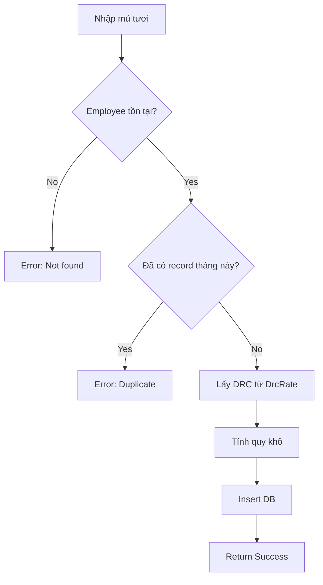

# Production Tracking - Quản lý Sản lượng Mủ Cao Su

> **Cập nhật lần cuối:** 2026-04-22
> **Người thực hiện:** Claude Agent
> **Trạng thái:** Production

## 1. Tổng quan

### Mục đích
Quản lý và theo dõi sản lượng mủ cao su của từng công nhân theo tháng, bao gồm quy đổi từ mủ tươi sang mủ khô theo tỷ lệ DRC (Dry Rubber Content).

### Phạm vi
- ✅ Nhập sản lượng mủ tươi theo loại (mủ nước, mủ dây, mủ serum)
- ✅ Tự động quy đổi sang mủ khô theo DRC
- ✅ Theo dõi mủ chuyển tháng (carry over)
- ✅ Xếp hạng kỹ thuật công nhân (A/B/C/D)
- ❌ KHÔNG tính tiền lương (thuộc module Payroll)
- ❌ KHÔNG quản lý DRC (thuộc module DRC Rate)

### Liên quan đến
- **Attendance**: Công nhân phải có chấm công mới có sản lượng
- **Employee**: Thông tin công nhân
- **DRC Rate**: Tỷ lệ quy đổi mủ khô
- **Payroll**: Sử dụng TotalPayKg để tính lương

---

## 2. Business Rules

### Quy tắc nghiệp vụ chính

| STT | Quy tắc | Mô tả | Ví dụ |
|-----|---------|-------|-------|
| BR-01 | Unique per employee/month | Mỗi nhân viên chỉ có 1 record sản lượng/tháng | NV001 chỉ có 1 dòng cho 2025-11 |
| BR-02 | DRC từ trạm | DRC tự động lấy từ bảng DrcRate theo TramId và YearMonth | Trạm 1 tháng 11: 38.51% |
| BR-03 | Mủ tươi không lẻ | Kg mủ tươi phải là số nguyên | 9.3kg → 9kg |
| BR-04 | Cắt 2 số thập phân | Mủ khô cắt 2 số sau dấu chấm (không làm tròn) | 12.567 → 12.56 |
| BR-05 | Soft delete | Xóa bằng Status = -1, không xóa vật lý | |

### Công thức tính toán

```
Quy khô mủ nước:
DryLatexKg = RawLatexKg × DrcRaw

Quy khô mủ dây:
RopeDryKg = RopeLatexKg × DrcRaw

Quy khô mủ serum:
SerumDryKg = SerumKg × DrcSerum

Tổng khô tháng này:
DryLatexKg = DryLatexKg + RopeDryKg + SerumDryKg

Tổng thanh toán:
TotalPayKg = DryLatexKg + CarryDryKg
```

**Ví dụ cụ thể:**
```
Input:
- RawLatexKg = 100 kg
- RopeLatexKg = 20 kg
- SerumKg = 10 kg
- DrcRaw = 0.3851 (38.51%)
- DrcSerum = 0.20 (20%)
- CarryDryKg = 5 kg (từ tháng trước)

Tính:
- Khô mủ nước = 100 × 0.3851 = 38.51 kg
- Khô mủ dây = 20 × 0.3851 = 7.70 kg
- Khô serum = 10 × 0.20 = 2.00 kg
- DryLatexKg = 38.51 + 7.70 + 2.00 = 48.21 kg
- TotalPayKg = 48.21 + 5 = 53.21 kg
```

### Ràng buộc dữ liệu

| Field | Kiểu | Bắt buộc | Ràng buộc | Ghi chú |
|-------|------|----------|-----------|---------|
| EmployeeId | int | ✅ | FK → Employee | |
| YearMonth | varchar(7) | ✅ | Format YYYY-MM | "2025-11" |
| RawLatexKg | decimal(10,2) | ✅ | >= 0 | Mủ nước |
| RopeLatexKg | decimal(10,2) | ✅ | >= 0 | Mủ dây |
| SerumKg | decimal(10,2) | ✅ | >= 0 | Mủ serum |
| CarryOverKg | decimal(10,2) | | >= 0 | Mủ tươi chuyển tháng |
| DrcRaw | decimal(8,4) | | 0-1 | Override DRC trạm |
| DrcSerum | decimal(8,4) | | 0-1 | Override DRC serum |
| DryLatexKg | decimal(10,2) | Auto | | Tính tự động |
| CarryDryKg | decimal(10,2) | | >= 0 | Khô chuyển tháng |
| TotalPayKg | decimal(10,2) | Auto | | Tính tự động |
| TechGrade | varchar(5) | | A/B/C/D | Hạng kỹ thuật |

---

## 3. Luồng xử lý (Flow)

### Flow tạo sản lượng

```
[1] User nhập mủ tươi (Raw, Rope, Serum)
    ↓
[2] Validate: Check employee exists, check unique (employee, yearMonth)
    ↓
[3] Lấy DRC từ DrcRate theo TramId + YearMonth (nếu không override)
    ↓
[4] Tính DryLatexKg = Sum(mủ tươi × DRC tương ứng)
    ↓
[5] Tính TotalPayKg = DryLatexKg + CarryDryKg
    ↓
[6] Insert Production với Status = 1
    ↓
[7] Return MRes_Production với thông tin Employee, Tram
```

### Flow diagram



### Các trường hợp đặc biệt

| Case | Điều kiện | Xử lý |
|------|-----------|-------|
| Không có DRC trạm | DrcRate không tồn tại cho tháng/trạm | Sử dụng DRC từ request hoặc mặc định 0.40 |
| Override DRC | User nhập DrcRaw trong request | Ưu tiên DRC từ request |
| Mủ tươi = 0 | Tất cả loại mủ = 0 | Cho phép, DryLatexKg = 0 |

---

## 4. Cấu trúc Code

### Files liên quan

| File | Vai trò | Ghi chú |
|------|---------|---------|
| `API_Sample.Data/Entities/Production.cs` | Entity | Table `production` |
| `API_Sample.Models/Request/MReq_Production.cs` | Request DTO | Input validation |
| `API_Sample.Models/Response/MRes_Production.cs` | Response DTO | Flatten employee info |
| `API_Sample.Application/Services/S_Production.cs` | Service | Business logic |
| `API_Sample.WebApi/Controllers/ProductionController.cs` | Controller | API endpoints |
| `API_Sample.Application/Mapper/AutoMapperProfile.cs` | Mapping | Production ↔ DTO |
| `Tien_Luong/src/pages/Production/ProductionEntry.tsx` | Frontend | UI nhập liệu |
| `Tien_Luong/src/services/productionService.ts` | Frontend API | API calls |

### Database Schema

```sql
-- Table: production
CREATE TABLE [production] (
    [id] int NOT NULL IDENTITY,
    [employee_id] int NOT NULL,              -- FK → employee
    [year_month] nvarchar(7) NOT NULL,       -- "2025-11"
    [raw_latex_kg] decimal(10,2) NOT NULL,   -- Mủ nước tươi
    [rope_latex_kg] decimal(10,2) NOT NULL,  -- Mủ dây tươi
    [serum_kg] decimal(10,2) NOT NULL,       -- Mủ serum tươi
    [carry_over_kg] decimal(10,2) NOT NULL,  -- Mủ tươi chuyển tháng
    [drc_raw] decimal(8,4) NULL,             -- Override DRC mủ nước
    [drc_serum] decimal(8,4) NULL,           -- Override DRC serum
    [dry_latex_kg] decimal(10,2) NOT NULL,   -- Tổng quy khô
    [carry_dry_kg] decimal(10,2) NOT NULL,   -- Khô chuyển tháng
    [total_pay_kg] decimal(10,2) NOT NULL,   -- Tổng thanh toán
    [tech_grade] nvarchar(5) NULL,           -- A/B/C/D
    [note] nvarchar(500) NULL,
    [status] smallint NOT NULL,
    [created_at] datetime NOT NULL,
    [created_by] int NOT NULL,
    [updated_at] datetime NULL,
    [updated_by] int NULL,
    CONSTRAINT [PK_production] PRIMARY KEY ([id]),
    CONSTRAINT [FK_production_employee] FOREIGN KEY ([employee_id]) 
        REFERENCES [employee] ([id])
);

-- Index unique: 1 record per employee per month
CREATE UNIQUE INDEX [IX_production_employee_yearmonth] 
    ON [production] ([employee_id], [year_month]);
```

### API Endpoints

| Method | Endpoint | Mô tả | Request | Response |
|--------|----------|-------|---------|----------|
| POST | `/Production/Create` | Tạo sản lượng | `MReq_Production` | `MRes_Production` |
| PUT | `/Production/Update` | Cập nhật | `MReq_Production` | `MRes_Production` |
| PUT | `/Production/UpdateStatus` | Đổi trạng thái | `?id=&status=` | `int` |
| DELETE | `/Production/Delete` | Xóa mềm | `?id=` | `int` |
| GET | `/Production/GetById` | Lấy theo ID | `?id=` | `MRes_Production` |
| GET | `/Production/GetListByPaging` | Danh sách có paging | `MReq_Production_FullParam` | `List<MRes_Production>` |
| GET | `/Production/GetListByFullParam` | Danh sách không paging | `MReq_Production_FullParam` | `List<MRes_Production>` |

---

## 5. Logic chi tiết

### S_Production.Create()

**Mục đích:** Tạo mới record sản lượng cho nhân viên

**Input:**
- `request` (MReq_Production): Thông tin sản lượng

**Output:** `ResponseData<MRes_Production>`

**Logic:**
1. Check trùng lặp (EmployeeId + YearMonth)
2. Map request → entity
3. Tính TotalPayKg = DryLatexKg + CarryDryKg
4. Set audit fields (CreatedAt, CreatedBy, Status=1)
5. Insert database
6. Load lại với Include Employee, Tram
7. Map → response

**Code:**
```csharp
public async Task<ResponseData<MRes_Production>> Create(MReq_Production request)
{
    try
    {
        // 1. Check duplicate
        if (await _context.Productions.AnyAsync(x =>
            x.EmployeeId == request.EmployeeId &&
            x.YearMonth == request.YearMonth &&
            x.Status != -1))
            return Error(HttpStatusCode.Conflict, "Sản lượng tháng này đã tồn tại!");

        // 2. Map
        var data = _mapper.Map<Production>(request);
        data.CreatedAt = DateTime.UtcNow;
        data.CreatedBy = request.CreatedBy;
        data.Status = 1;

        // 3. Calculate
        data.TotalPayKg = data.DryLatexKg + data.CarryDryKg;

        // 4. Insert
        _context.Productions.Add(data);
        if (await _context.SaveChangesAsync() == 0)
            return Error(HttpStatusCode.InternalServerError, "Không thể tạo!");

        // 5. Load with relations
        var result = await _context.Productions
            .Include(x => x.Employee).ThenInclude(e => e.Tram)
            .FirstOrDefaultAsync(x => x.Id == data.Id);

        return new ResponseData<MRes_Production>(1, 201, "Tạo thành công")
        {
            data = _mapper.Map<MRes_Production>(result)
        };
    }
    catch (Exception ex)
    {
        return CatchException(ex, nameof(Create), request);
    }
}
```

### BuildFilterQuery()

**Mục đích:** Xây dựng query filter cho GetList

**Logic:**
```csharp
private IQueryable<Production> BuildFilterQuery(MReq_Production_FullParam request)
{
    var query = _context.Productions
        .AsNoTracking()
        .Include(x => x.Employee).ThenInclude(e => e.Tram)
        .Where(x => x.Status != -1);

    if (!string.IsNullOrEmpty(request.SequenceStatus))
    {
        var statusList = request.SequenceStatus.Split(',').Select(short.Parse);
        query = query.Where(x => statusList.Contains(x.Status));
    }

    if (request.EmployeeId.HasValue)
        query = query.Where(x => x.EmployeeId == request.EmployeeId);

    if (request.TramId.HasValue)
        query = query.Where(x => x.Employee.TramId == request.TramId);

    if (!string.IsNullOrEmpty(request.YearMonth))
        query = query.Where(x => x.YearMonth == request.YearMonth);

    if (!string.IsNullOrEmpty(request.TechGrade))
        query = query.Where(x => x.TechGrade == request.TechGrade);

    return query;
}
```

---

## 6. Validation & Error Handling

### Validation Rules

| Field | Rule | Error Message |
|-------|------|---------------|
| EmployeeId | Required | "Nhân viên là bắt buộc" |
| YearMonth | Required, Format | "Tháng/năm là bắt buộc" |
| RawLatexKg | Range >= 0 | "Mủ nước không được âm" |
| Duplicate | Unique(EmployeeId, YearMonth) | "Sản lượng tháng này đã tồn tại!" |

### Error Codes

| Code | HTTP Status | Message | Khi nào xảy ra |
|------|-------------|---------|----------------|
| 0 | 409 Conflict | "Sản lượng tháng này đã tồn tại!" | Create duplicate |
| 0 | 404 NotFound | "Không tìm thấy dữ liệu" | GetById/Update không tìm thấy |
| -1 | 500 | "Exception" | Lỗi hệ thống |

---

## 7. Test Cases

### Unit Tests

| Test Case | Input | Expected Output | Status |
|-----------|-------|-----------------|--------|
| TC-01: Create success | Valid data | result=1, data có Id | ✅ |
| TC-02: Create duplicate | Same employee+month | result=0, Conflict | ✅ |
| TC-03: Calculate dry | Raw=100, DRC=0.4 | DryLatexKg=40 | ✅ |
| TC-04: GetById exists | id=1 | result=1, data | ✅ |
| TC-05: GetById deleted | Status=-1 | result=0, NotFound | ✅ |

---

## 8. Cấu hình & Dependencies

### Dependencies

- **Employee Service**: Validate employee exists
- **DRC Rate Service**: Get DRC for calculation
- **AutoMapper**: Entity ↔ DTO mapping

---

## 9. Changelog

| Ngày | Người | Thay đổi |
|------|-------|----------|
| 2026-04-22 | Claude | Initial implementation |
| 2026-04-22 | Claude | Add TechGrade field |

---

## 10. Notes & TODOs

### Lưu ý quan trọng
- Mủ tươi nhập từ KCS trạm hằng ngày
- DRC được KCS trạm cán hằng ngày, cuối tháng lấy trung bình
- Quy khô sai cần điều chỉnh qua module truy thu

### TODOs
- [ ] Thêm API bulk import từ Excel
- [ ] Thêm validation DRC range (0.30 - 0.50)
- [ ] Thêm history tracking cho điều chỉnh
